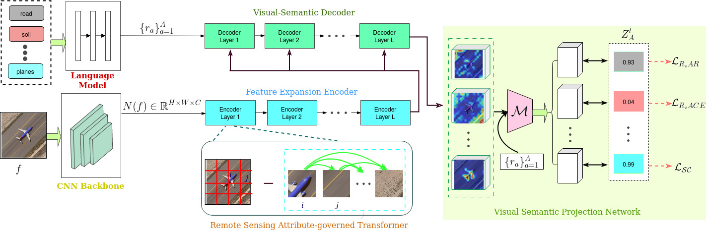

**ZS-ViDAT**


This github repository consists of the training code for the paper  "ZS-ViDAT: Visual descriptions using an Attribute-governed Transformer for zero-shot scene classification in remote sensing images". 

This paper mainly focus on creating visual descriptions, i.e., semantic attributes for the four prominent remote sensing benchmark datasets (i.e., UCM21, AID30, NWPU-RESISC45, and WHU-RS19). For each class, we identified the objects that differentiates it from all the other classes and also some common attributes in various classes were also considered. For the UCM21, AID30, NWPU45, and WHU-RS19 datasets, we have created 33, 44, 57, and 26 semantic attributes, respectively. These semantic attributes and attribute over values are available at ./data/xlsa17/code/... .

**The framework for the ZS-ViDAT**



**Dependencies to run the ZS-ViDAT**

The implementation of "ZS-ViDAT" is based on Python 3.8.8 and [PyTorch](https://pytorch.org/) 1.8.0. To install all required dependencies:
```
$ pip install -r requirements.txt
```

Furthermore, we use [Weights & Biases](https://wandb.ai/site) (W&B) to keep track and organize the results of experiments. You may need to follow the [online documentation](https://docs.wandb.ai/quickstart) of W&B to quickstart. To run these codes, [sign up](https://app.wandb.ai/login?signup=true) an online account to track experiments or create a [local wandb server](https://hub.docker.com/r/wandb/local) using docker (recommended).


**Downloading datasets**

We trained the model "ZS-VIDAT" on four prominent banchmark datasets of the zero-shot scene classification in remote sensing images: [UCM21](http://weegee.vision.ucmerced.edu/datasets/landuse.html), [AID30](https://captain-whu.github.io/AID/), NWPU45, and WHU-RS19. Please download NWPU and RS19 datasets on your own way. In order to train the "ZSViDAT", first you should download these datasets. Then decompress and organize them as: 
```
.
├── data
│   ├── UCM/...
│   ├── AID/...
│   ├── NWPU/...
│   └── RSD/...
└── ···
```

**Extracting visual features**    

Follow the instructions in ZS-ViDAT/data/xlsa17/code/readme.txt file in order to obtain res101.mat and att_splits.mat files, and place them in ZS-ViDAT/data/xlsa17/data/{dataset}/... . 

Run the specified commands in order to extract the visual features of four datasets:

```
$ python preprocessing.py --dataset UCM --compression --device cuda:0 
$ python preprocessing.py --dataset AID --compression --device cuda:0
$ python preprocessing.py --dataset NWPU --compression --device cuda:0
$ python preprocessing.py --dataset RSD --compression --device cuda:0

Note: Adjust the "split_idx" value in preprocessing.py file according to the dataset path if you get FileNotFoundError while running the above code.
```

**Training ZS-ViDAT**

In `./wandb_config`, we provide parameters setting of conventional zero-shot learning (CZSL) and generalized zero-shot learning (GZSL) tasks for UCM21, AID30, NWPU45, and RS19. 
Run the given commands in order to train the "ZS-ViDAT" from scratch:

```
$ python train_ucm.py   # UCM
$ python train_aid.py   # AID
$ python train_nwpu.py  # NWPU
$ python train_rsd.py  # RSD
```
Note: Please load the corresponding setting when aiming at the CZSL task.
